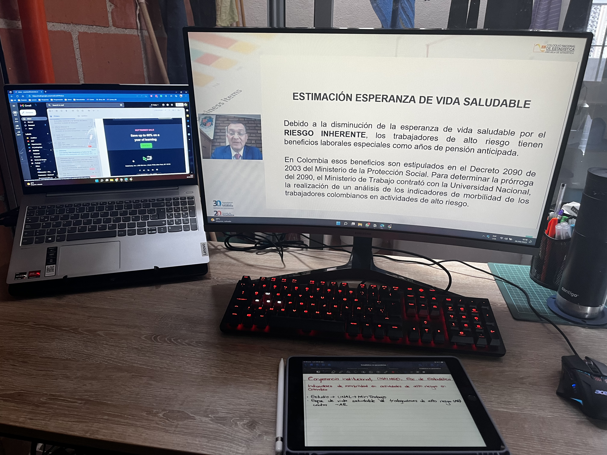
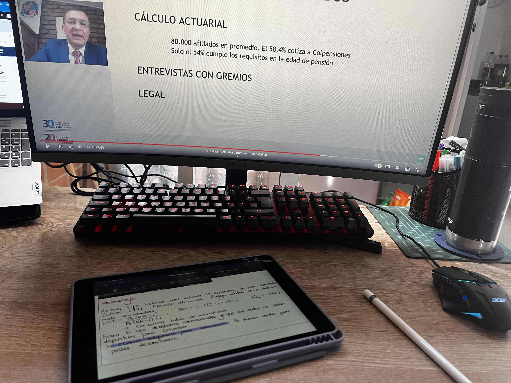

\newpage

```{r setup, include = FALSE, warning = FALSE, message = FALSE}
knitr::opts_chunk$set(echo = TRUE)
```

```{=latex}
\setcounter{tocdepth}{4}
\tableofcontents
```

\newpage

# Introducción

|       Los sistemas provisionales y sanitarios se encargan de ofrecer servicios de pensión y salud a los afiliados, que suelen ser los trabajadores formales que cotizan o cotizaron durante su vida laboral, y en algunos casos estos servicios se aplican también a los beneficiarios de los trabajadores. No obstante, entre los trabajadores pueden presentarse una gran diversidad de situaciones y características que hacen que sea importante segmentar a los trabajadores según algunas variables importantes, como los **riesgos** a los que están expuestos por la realización de sus labores.

|       Esto es fundamental en el sentido que estos factores de riesgo a los que pueden exponerse los cotizantes pueden implicar en el futuro costos adicionales al sistema provisional o de salud, bien sea con beneficios adicionales como una pensión anticipada, lo cual representa un mayor costo para el sistema al tener que pagar mesadas de forma anticipada respecto al promedio de los cotizantes que logran pensionarse, así como asumir costos mayores por las enfermedades que pueden desarrollar los laburantes al finalizar su vida laboral o incluso durante esta.

|       De esta forma, un grupo de investigadores de la distintas universidades como la Universidad Nacional de Colombia (sede Bogotá) y la Potificia Universidad Javeriana (ubicada en la capital de Colombia) fueron escogidos por el Ministerio del Trabajo de la República de Colombia para estudiar los ***indicadores de morbilidad en actividades de alto riesgo*** en dicho país, y en este documento se presenta pues un informe de la exposición realizada sobre este tópico por parte de uno de estos investigadores, el profesor *Jaime Abel Huertas Campos*, del Departamento de Estadística de la UN Bogotá, en la Conferencia Institucional de la Escuela de Estadística de la Universidad Nacional de Colombia (sede Medellín) el día lunes 19 de septiembre de 2022.

\newpage

# Informe

|       Dentro de cualquier mercado laboral es posible hallar trabajadores que se desempeñan en actividades distintas entre sí, lo cual implica que estén expuestos a niveles de riesgo diferentes, y que por tanto los aseguramientos que tienen estos trabajadores también difieran. Así pues, se pueden encontrar a trabajadores de oficina o personal docente que pueden verse expuestos a estrés o fatiga, así como bomberos o mineros de socavón que deben enfrentarse a llamas, altas temperaturas y gases nocivos, entre otros, lo cual hace que no solo el ejercicio de sus labores sea más peligroso y que por tanto deban tener servicios sanitarios pertinentes (que usualmente son más costosos), sino que también tienen acceso a beneficios provisionales, como en el caso de Colombia, donde estos trabajadores pueden tener acceso a una pensión anticipada siempre que estén afiliados al régimen de prima media, institucionalizado en nuestro país por *Colpensiones*, todo esto regido mediante el Código Sustantivo del Trabajo y sus resoluciones y decretos reglamentarios, como el **decreto 2090 de 2003**.

|       Para poder hacer el estudio, se buscaron las bases de datos de siniestros y otras que tuvieran información asociada a los accidentes laborales y la degradación de la salud de los trabajadores en el ejercicio de sus labores, encontrando que se carecía de información en el 87.5 % de los casos relacionados con accidentes laborales y en el 6.9 % de los casos relacionados con enfermedades laborales. Esto por supuesto llama la atención porque implica una carencia de información significativa que dificulta las labores académicas que buscan respaldar proyectos de ley dirigidos a reglamentar el trabajo en Colombia, en especial en condiciones de interés esta, pues las enfermedades y riesgos laborales asociadas a actividades de alto riesgo suelen ser más costosas.

|       Así, se barajan varias hipótesis para los motivos que puedan explicar el porqué del subregistro que se tiene en estas bases de datos, y una de ellas viene de la Federación de Aseguradores Colombianos (Fasecolda), que explica que en Colombia se tienen tasas de rotación laboral altas en comparación con otros países del mundo, de forma que enfermedades típicamente asociadas a actividades laborales de alto riesgo no se gestan ya que los trabajadores no permanecen expuestos a los factores de riesgo por tiempos prolongados, pero también barajan la opción de que estas enfermedades pueden estar siendo tratadas mediante el sistema de **riesgo común** a cargo de las empresas prestadoras de salud (EPS), que se supone ofrecen sus servicios para casos corrientes no asociados a accidentes laborales, en lugar de ser atendidas por las aseguradas de riesgos laborales (ARL), las cuales sí tiene vocación de atención en este tipo de situaciones. De hecho, el Ministerio del Trabajo considera que esta puede ser la opción más plausible y que cuenta con estudios que respaldan esa hipótesis; empero, ante el desconocimiento de tales estudios por parte de los investigadores y sin posibilidad de confirmar esto con los datos disponibles, esta hipótesis se conserva como un supuesto pendiente de verificar.

|       Ahora bien, lo que sí resulta perentorio es poder contar con buenos datos en el futuro para poder tomar decisiones adecuadas más adelante y no enfrentar las mismas dificultades que se tienen actualmente, para lo cual los investigadores sugieren crear un Observatorio que se encarge de velar por el buen registro de la información y la generación continua de indicadores que permitan hacer un seguimiento continuo al sistema de riesgos laborales que tiene, como ya se ha mencionado, un cargo económico importante para los sistemas sanitario y provisional de Colombia.

|       Aún así, continuando con la investigación, se encuentra que en Colombia deben haber aproximadamente 209 mil personas que se desempeñan en actividades que se pueden clasificar como de alto riesgo laboral. Para poder determinar esto, como no se tenían datos adecuados para poder determinar cuáles son estos trabajadores, se tuvo que acudir a un grupo de expertos que clasificaron las empresas y las distintas ocupaciones y profesiones en cinco categorías, siendo la uno la de menor riesgo y la cinco la de mayor riesgo laboral. Nótese que esto es relevante ya que se encuentra que aproximadamente el 2 % de la población trabajadora en Colombia realiza actividades de alto riesgo.

|       Ya con estos trabajadores clasificados, al entrar a verificar cuáles son las enfermedades o accidentes qué más los aqueja, se halla algo interesante y es que las enfermedades que con más frecuencia ocurren entre los trabajadores de bajo riesgo también están presentes en los trabajadores de alto riesgo laboral, siendo destacables las enfermedades neurológicas, las enfermedades del sistema osteomuscular y el dolor lumbar. La diferencia se encuentra, pues, en la tasa con la que estas enfermedades suceden, siendo más frecuentes, como es esperar, entre los trabajadores de alto riesgo. También se encontró que la severidad de estas enfermedades también es mayor conforme más alto es el nivel de riesgo que asumen los colombianos en sus trabajos.

|       Sin embargo, es llamativo observar que no se encontró cáncer entre los trabajadores de alto riesgo laboral, lo cual sí sucede con frecuencia en otros países, pero aún más interesante es observar que en Colombia por cada 125 muertes accidentales hay una muerte laboral, lo cual contrasta con el promedio del mundo que cuenta con sesenta muertes por enfermedades laborales por una sola muerte accidental, haciendo esto evidente, pues, la carencia de registros adecuados en el país, lo cual abre un interrogante relevante y es ***¿cómo lograr que las enfermedades comunes no sean tratadas miedantes el sistema de riesgos comunes a cargo de las EPS?***, y así mismo vale la pena preguntarse: ***¿cómo lograr una mejor trazabilidad en el país?*** No se puede perder de vista que Colombia tiene empresas grandes y medianas con registros de datos sobre la salud de sus empleados y los puestos que han ocupado pobres, y la cuestión se vuelve aún más alarmante cuando se considera que este país posee un nivel de informalidad laboral alto, lo cual impacta la trazabilidad en el país en tanto las personas o las empresas informales no guardan datos de sus actividades laborales, ni siquiera en temas de salud.

## Metodología

|       Siendo conscientes entonces de estas problemáticas, como se carecen de datos históricos para la estimación de la **esperanza de vida saludable** de los empleados en Colombia de acuerdo con su nivel de riesgo, se apeló a la metodología de *Sulivan* de 1971 basado en la fracción atribuible, pero para poder aplicar esta metodología es necesario conocer el riesgo relativo asociado a una determinada enfermedad, para lo cual se acudió a tablas de mortalidad pero, en el contexto de datos ausentes, se usaron estudios internacionales de países que son más disciplinados en el registro histórico de estos datos.

## Resultados

|       Una vez aplicada pues esta metodología, se encontró que no existen diferencias significativas entre los trabajadores de riesgos más bajos con los empleados de riesgos más altos en Colombia. No obstante, llamó la atención que en la actualidad hay 80 mil afiliados en promedio, de los cuales el 58.4 % está afiliado al sistema de prima media (Colpensiones) y de estos solo el 54 % cumple con los requisitos para poder acceder a una pensión por este sistema en el futuro.

|       Estos últimos datos actuariales son reveladores, ya que si se tiene en cuenta que se estima que hay más de doscientos mil trabajadores que realizan actividades de alto riesgo, entonces se tienen en Colombia aproximadamente 120 mil empleados que no cotizan de forma adecuada para poder acceder a los beneficios que tienen los empleados de alto riesgo (como la pensión anticipada), para lo cual sus empleadores están en la obligación de pagar diez puntos adicionales al sistema provisional.

|       No obstante, estos beneficios contrastan con las tendencias mundiales en actividades de alto riesgo, pues la mayoría de países, y en especial los desarrollados, ya no están apelando a beneficios anticipados para los trabajadores de estas actividades riesgosas, sino que constantemente se preocupan por el cuidado y la prevención, permitiendo que la gestación de enfermedades laborales delicadas sea menos probable.

# Reflexión, crítica y preguntas

Los sistemas provisionales deben ser estudiados con el mayor rigor técnico para evitar que se incurra en gastos deficitarios que pueden desbalancear de forma muy negativa las cuentas públicas de todo país, y que a la final, repercute mal no solo para los pensionistas del presente, sino especialmente para los del futuro. Así las cosas, estos sistemas deben estar organizados de tal forma que puedan recolectar de forma ágil, oportuna y constante una cantidad de datos masiva pero útil, de tal suerte que se tenga siempre acceso a información de calidad que permita tomar decisiones adecuadas.

Así pues, en el caso colombiano es perentorio concientizar a las empresas y a los trabajadores, sean formales o informales, de la importancia de llevar un registro de información laboral de diferentes categorías, incluyendo por supuesto información de salud que facilite la trazabilidad de las enfermedades laborales que pueden irse gestando en los trabajadores.

Además, las autoridades púbicas deben asumir la responsabilidad de orientar de forma adecuada a las empresas y a los trabajadores para que se encarguen de esto, ya que no hacerlo puede resultar costoso y poco beneficioso para las personas y las empresas de cara al futuro.

Ahora bien, en cuanto a la metodología expuesta por el profesor Huertas, sería curioso conocer qué información internacional fue recolectada para poder hacer los cálculos de riesgos relativos en Colombia, ya que el proceso de imputación para nuestro país podría ser infructuoso si se toma únicamente a los países desarrollados que tienen mercados laborales y sistemas sanitarios muy distintos a los que se tienen en Colombia, y esto se refleja en índices como el de la esperanza de vida, que suele ser mayor en estos países, como España o Japón, de tal suerte que sería más productivo tomar países con contextos parecidos al colombiano, como otras naciones latinoamericanas, o economías asiáticas emergentes.

# Conclusiones.

- Los trabajadores de alto riesgo en Colombia pueden presentar enfermedades similares a las que tienen los empleados de riesgos más bajos, pero tendrán severidades y tasas mayores.
- Llevar un registro de datos de salud laboral es fundamental para poder tomar decisiones adecuadas respecto a políticas públicas que impacten los sistemas sanitarios y provisionales.
-  Los empleados deben ser más conscientes de sus enfermedades y la forma en que las tratan, para no acudir al régimen común sino al de riesgos laborales cuando las causas u orígenes se asocian con sus actividades laborales. Esto también facilitará tener un registro de datos adecuados a través de las aseguradoras de riesgos laborales.

# Evidencia fotográfica







